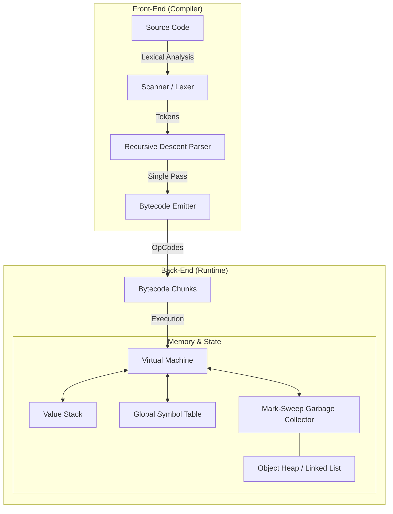

# Inter-CPP 🚀

Inter-CPP is a high-performance, bytecode-oriented interpreter for the Lox language, engineered from the ground up using **Modern C++17**. It bridges the gap between high-level language abstractions and low-level system performance, featuring a stack-based virtual machine, a sophisticated compiler, and a custom garbage collection system.

## 🏗️ Architecture Overview

The system follows a classic compiler-interpreter pipeline, optimized for memory efficiency and execution speed.



## ✨ Core Features

*   **⚡ Optimized Bytecode VM**: A stack-based execution engine with zero-overhead instruction dispatch.
*   **🛠️ Pratt Parser**: A powerful hand-written recursive descent parser for robust expression evaluation.
*   **♻️ Mark-Sweep GC**: Automated memory management with a focus on low-latency object reclamation.
*   **📦 Advanced OOP**: Complete support for classes, inheritance, method binding, and property access.
*   **🔗 Closures & Upvalues**: Sophisticated scope capture using an open/closed upvalue system.
*   **🔢 Native Integration**: Easy-to-use API for binding native C++ functions to Lox.
*   **➗ Math Extensions**: Native support for standard arithmetic including the `%` modulo operator.

## 🚀 Getting Started

### Prerequisites

*   **C++17** compatible compiler (GCC 7+, Clang 5+, or MSVC 2017+)
*   **CMake** 3.10+

### Build Instructions

```bash
mkdir -p build && cd build
cmake ..
make -j$(nproc)
```

### Usage

**Run a script:**
```bash
./intercpp path/to/script.lox
```

**Interactive REPL:**
```bash
./intercpp
```

## 📜 Language Specification

Inter-CPP supports the full Lox specification, including:
- Variables (`var x = 10;`)
- Control Flow (`if`, `else`, `while`, `for`)
- Functions & Closures (`fun adder(n) { return fun(x) { return x + n; }; }`)
- Classes & Inheritance (`class B < A { ... }`)
- The newly added `%` modulo operator for numeric calculations.

---

*Built with passion for systems programming.*
