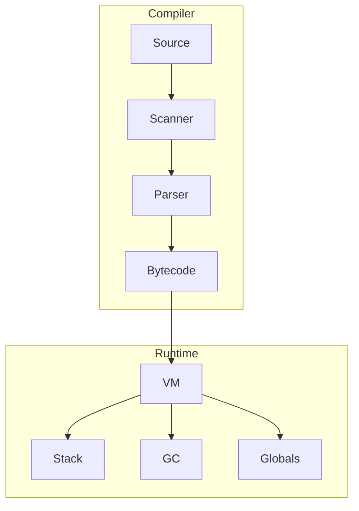

# inter-cpp

A bytecode interpreter for the Lox language implemented in C++17. This project features a stack-based virtual machine, a custom garbage collector, and a recursive-descent parser.

## Architecture

The interpreter is divided into a front-end compiler that produces bytecode and a back-end virtual machine that executes it.



### Components

*   **Virtual Machine**: A stack-based VM that executes custom OpCodes. It manages call frames for function execution and handles the value stack.
*   **Compiler**: A single-pass compiler using a Pratt parser for expressions. It generates bytecode directly during parsing to avoid multiple passes.
*   **Garbage Collector**: A mark-and-sweep GC that tracks all heap-allocated objects. It is integrated into the VM's allocation logic.
*   **Object System**: Support for strings (with interning), closures, classes, and instances.

## Technical Details

*   **Modern C++**: Uses C++17 features like `std::variant` for the Value type and `std::string_view` where appropriate.
*   **Memory Management**: Custom allocation for objects to facilitate garbage collection.
*   **Performance**: Focused on efficient bytecode execution and reduced allocation overhead.

## Building and Running

### Requirements
*   CMake 3.10 or higher
*   C++17 compliant compiler

### Build
```bash
mkdir build
cd build
cmake ..
make
```

### Run
To run a script:
```bash
./intercpp <file_path>
```

To run the REPL:
```bash
./intercpp
```

## Features Supported
- Basic arithmetic and logic
- Global and local variables
- Control flow (if, while, for)
- Functions and closures
- Classes and inheritance
- Native function binding (e.g. clock for timing)
- Modulo operator (%)
